# MyCinema - Hệ Thống Đặt Vé Xem Phim Trực Tuyến Đa Nền Tảng

Hệ thống đặt vé xem phim trực tuyến thời gian thực (Real-time Seat Booking) được xây dựng trên mô hình Client-Server phân lớp. Ứng dụng di động được phát triển bằng **React Native (Expo)** và Backend API bằng **FastAPI (Python)** kết hợp với cơ sở dữ liệu **PostgreSQL** và bộ nhớ đệm **Redis** nhằm giải quyết triệt để bài toán Race Condition khi đặt ghế.

---

## ⚡ Điểm Nhấn Công Nghệ (Technical Snapshots)

*   **Real-time Synchronization (WebSocket)**: Đồng bộ sơ đồ ghế thời gian thực. Khi User A nhấn giữ ghế, sơ đồ ghế của User B tự động chuyển màu vàng (Đang giữ) mà không cần tải lại trang.
*   **Concurrency Control (Redis Lock)**: Sử dụng Redis Lock với TTL (Time-To-Live) 5 phút để khóa ghế tạm thời, ngăn chặn việc 2 người dùng đặt trùng một ghế trong cùng một thời điểm.
*   **Atomic Transaction**: Luồng thanh toán và ghi nhận vé được thực hiện dưới dạng một giao dịch nguyên tử trong PostgreSQL: Xác thực khóa ghế $\rightarrow$ Lưu hóa đơn thanh toán $\rightarrow$ Xuất vé $\rightarrow$ Giải phóng Redis Lock.
*   **Unmount Cleanup**: Tự động giải phóng ghế đang chọn qua API khi người dùng quay lại màn hình trước hoặc khi kết nối WebSocket bị ngắt đột ngột (mất mạng, sập nguồn).

---

## I. Khảo Sát Nghiệp Vụ Hệ Thống

### 1. Đặt Vấn Đề
Trong thời đại công nghệ số, việc mua vé truyền thống tại quầy thường gây bất tiện cho người dùng như xếp hàng lâu, rủi ro hết vé hoặc không chọn được chỗ ngồi ưng ý. 

Ứng dụng **MyCinema** ra đời nhằm giúp người dùng:
*   Tra cứu lịch chiếu, thông tin chi tiết phim (trailer, diễn viên, thời lượng) mọi lúc mọi nơi.
*   Đặt vé, chọn ghế trực quan và thanh toán nhanh chóng.
*   Hỗ trợ nhà rạp quản lý suất chiếu, phòng chiếu và doanh thu hiệu quả.

### 2. Mục Tiêu Hệ Thống
*   Xây dựng ứng dụng di động đa nền tảng hiện đại, mượt mà.
*   Đảm bảo tính chính xác cao trong quá trình đặt ghế, tuyệt đối không xảy ra tình trạng trùng ghế (double booking).
*   Giao diện sơ đồ phòng chiếu trực quan, cập nhật trạng thái động.

---

## II. Phân Tích & Thiết Kế Kiến Trúc

### 1. Phạm Vi Chức Năng
*   **Đăng ký & Đăng nhập**: Xác thực người dùng, bảo mật thông tin tài khoản.
*   **Tra cứu phim**: Xem danh sách phim đang chiếu, sắp chiếu, tìm kiếm phim theo tên.
*   **Đặt vé**: Chọn lịch chiếu, suất chiếu, phòng chiếu và số ghế mong muốn.
*   **Thanh toán**: Thanh toán hóa đơn và hiển thị vé dạng mã vạch để check-in tại rạp.
*   **Lịch sử giao dịch**: Xem danh sách các vé đã mua và chi tiết hóa đơn.

### 2. Sơ Đồ Hoạt Động (Activity Diagram)
Mô tả luồng hoạt động (workflow) từ lúc chọn phim đến lúc nhận vé thành công:

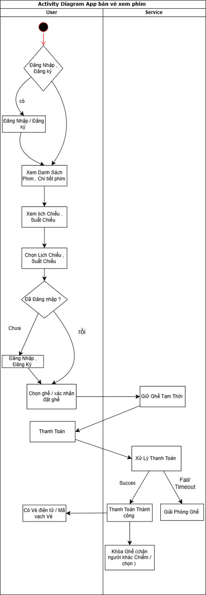

### 3. Sơ Đồ Tuần Tự Đặt Ghế Thời Gian Thực (Sequence Diagram)
Dưới đây là sơ đồ tương tác tuần tự mô tả cơ chế đồng bộ WebSocket và khóa ghế Redis:

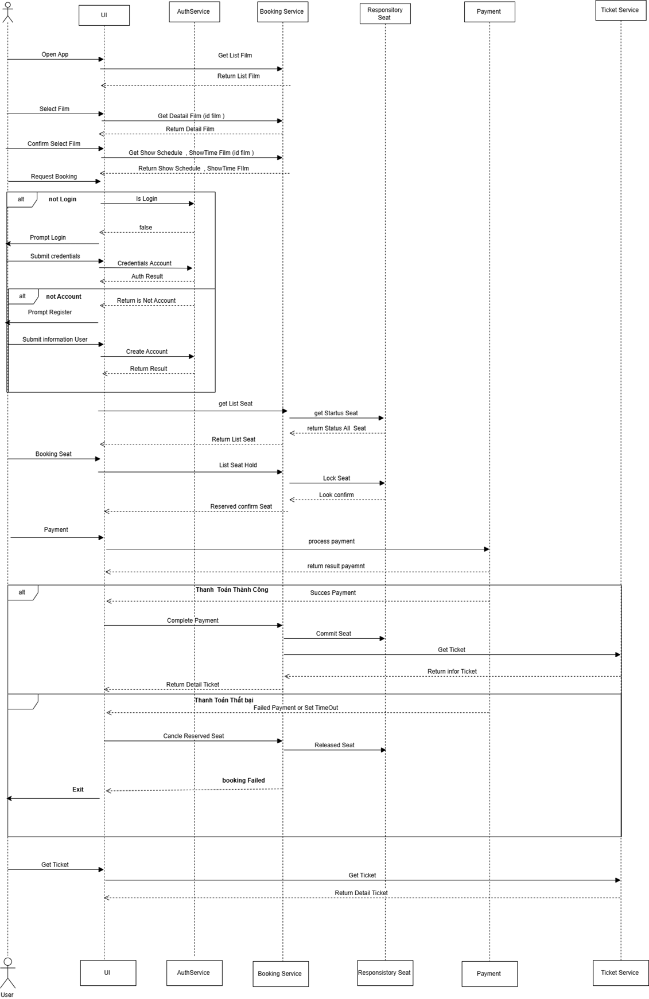

---

## III. Công Nghệ Sử Dụng & Công Cụ Phát Triển

### 1. Công Nghệ Sử Dụng
*   **Frontend**: React Native (Expo), React Navigation, Axios, WebSockets.
*   **Backend**: Python, FastAPI, SQLAlchemy (Async), Uvicorn.
*   **Database & Cache**: PostgreSQL (lưu trữ lâu dài), Redis (lưu trữ đệm khóa tạm thời).

### 2. Công Cụ & Dịch Vụ
*   **VS Code**: IDE phát triển ứng dụng.
*   **Cloudinary**: Quản lý và lưu trữ tập trung hình ảnh poster phim và tài nguyên media.
*   **Render**: Triển khai (deploy) API Backend trực tuyến hỗ trợ CI/CD.

---

## IV. Thiết Kế Cơ Sở Dữ Liệu

### 1. Sơ Đồ Tổng Quan CSDL (ERD)

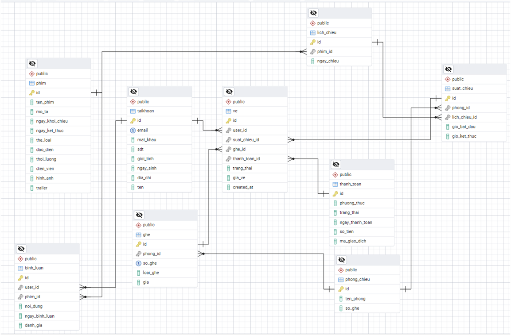

### 2. Mô Tả Chi Tiết Các Bảng Dữ Liệu

*   **Tài Khoản (User)**: Quản lý thông tin đăng nhập và cá nhân của khách hàng.  
    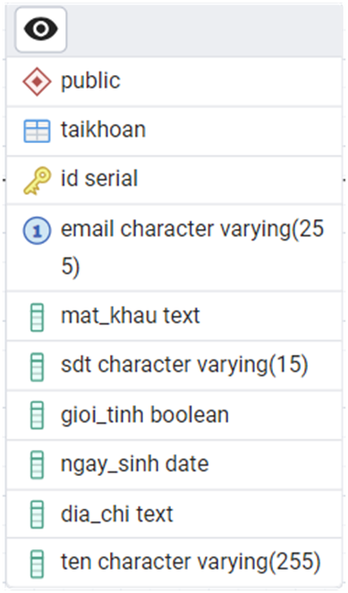
*   **Phim (Movie)**: Lưu trữ thông tin chi tiết phim, thể loại, thời lượng và ảnh.  
    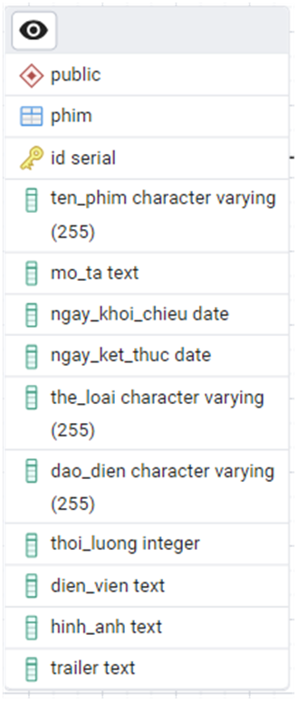
*   **Phòng Chiếu (Room)**: Danh sách các phòng chiếu hiện có tại rạp.  
    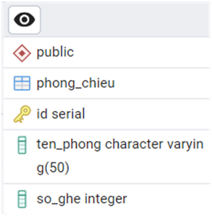
*   **Ghế (Seat)**: Danh mục các ghế thuộc từng phòng (Loại ghế VIP/Thường, Số ghế).  
    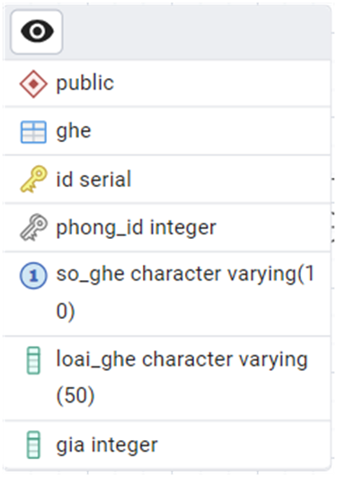
*   **Lịch Chiếu (Schedule)**: Ngày chiếu phim cụ thể.  
    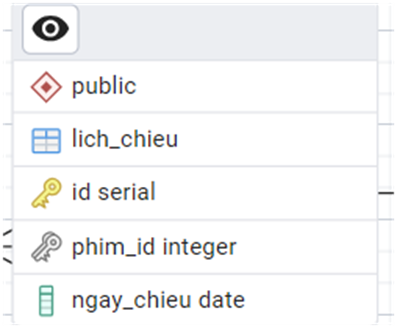
*   **Suất Chiếu (Showtime)**: Khung giờ chiếu của từng bộ phim tại từng phòng chiếu.  
    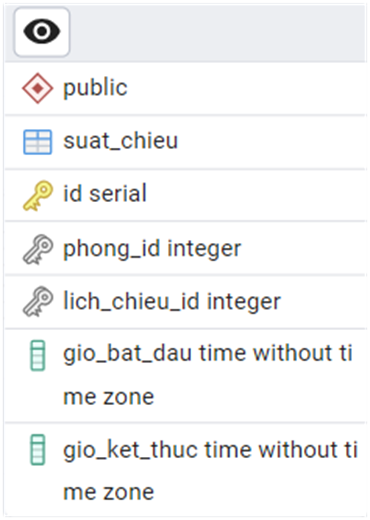
*   **Vé (Ticket)**: Bản ghi giao dịch ghế đã mua thành công.  
    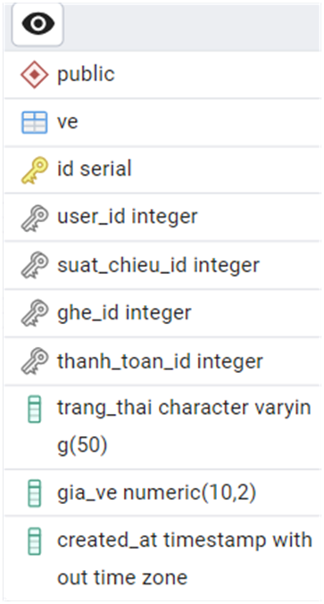
*   **Thanh Toán (Payment)**: Lưu trữ lịch sử giao dịch hóa đơn.  
    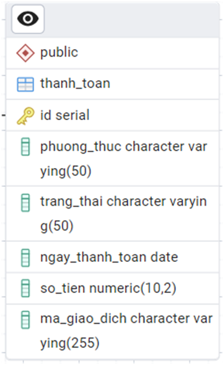

---

## V. Cấu Trúc Thư Mục Dự Án

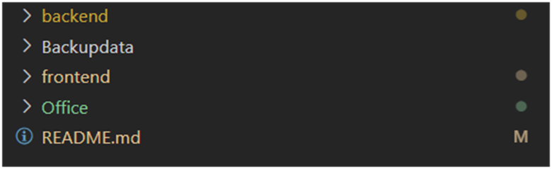

### 1. Cấu Trúc Frontend
```text
frontend/
├── assets/             # Lưu trữ hình ảnh, cấu hình màu sắc (color.js)
├── components/         # Các Component dùng chung (Header, Seat...)
├── context/            # Quản lý trạng thái toàn cục (Auth Context)
├── screens/            # Giao diện chính (HomeScreen, SelectSeatScreen...)
│   └── SelectSeatScreen.js   # Logic đặt ghế và kết nối WebSocket
├── service/            # Quản lý các hàm gọi API (APIservice.js, APIpath.js)
├── App.js              # Entry point của ứng dụng Expo
└── package.json        # Danh sách các dependencies thư viện
```

### 2. Cấu Trúc Backend
```text
backend/
├── app/
│   ├── api/            # Định nghĩa các endpoints API (V1)
│   │   └── v1/endpoints/
│   │       ├── websocket.py  # Xử lý kết nối socket & giữ ghế
│   │       ├── ChooseChair.py
│   │       └── payment.py
│   ├── core/           # Quản lý cấu hình JWT, websocket_manager.py
│   ├── database/       # Cấu hình session db (Database.py)
│   ├── models/         # Các models ORM SQLAlchemy (User, Ve, Ghe...)
│   ├── redis/          # Quản lý kết nối Redis (redis.py)
│   ├── schemas/        # Validate dữ liệu đầu vào bằng Pydantic (schemas.py)
│   └── services/       # Logic nghiệp vụ (ChooseChair.py, payment.py)
├── requirements.txt    # Danh sách thư viện Python
└── main.py             # Điểm chạy Uvicorn server
```

---

## VI. Đặc Tả Kỹ Thuật Đặt Ghế Thời Gian Thực

Hệ thống kết hợp WebSocket và Redis để quản lý vòng đời chiếm giữ ghế:

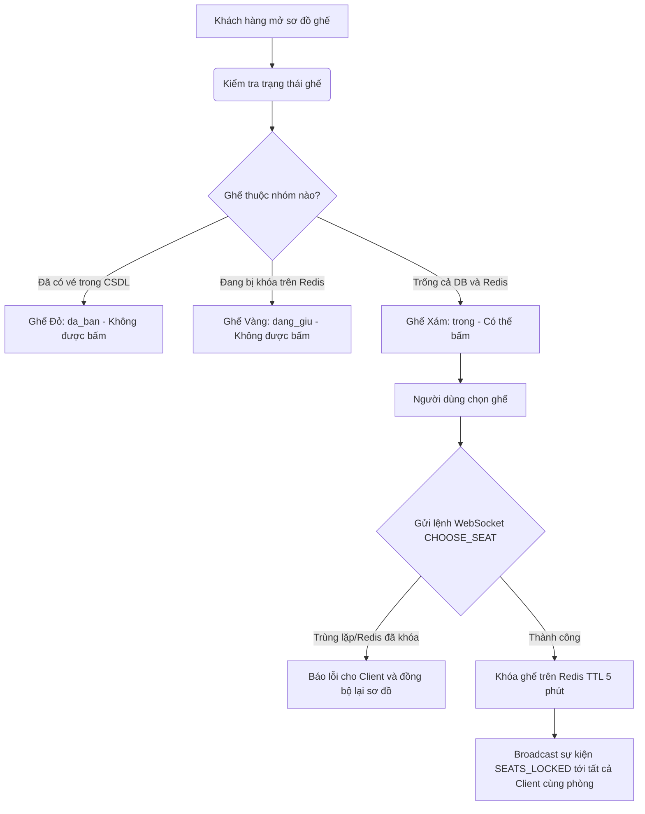

### Quy Trình Dọn Dẹp Ghế (Cleanup Mechanics)
1.  **Chủ động hủy chọn**: Client gửi tin nhắn `RELEASE_SEAT` $\rightarrow$ Backend xóa key trên Redis $\rightarrow$ Broadcast giải phóng ghế.
2.  **Thoát khỏi màn hình chọn ghế**: Khi unmount màn hình (không đi tiếp tới trang thanh toán), Client tự động gọi API `/xoa-ghe` để dọn dẹp các ghế đã chọn.
3.  **Mất kết nối đột ngột (Tắt app/Mất mạng)**: Kết nối WebSocket bị đứt $\rightarrow$ Sự kiện `WebSocketDisconnect` ở backend được kích hoạt $\rightarrow$ Tự động dọn dẹp toàn bộ ghế đang giữ của user đó trên Redis và broadcast cập nhật tới các client khác.
4.  **Thanh toán thành công**: Khi API `/Payment/confirm` xử lý thành công $\rightarrow$ Ghi nhận vé vĩnh viễn vào DB $\rightarrow$ Giải phóng key giữ ghế trên Redis.

---

## VII. Kịch Bản Kiểm Thử (Test Cases)

### 1. Module Tài Khoản (Account)
| Mã TC | Mô Tả | Bước Thực Hiện | Dữ Liệu Đầu Vào | Kết Quả Mong Đợi | Trạng Thái |
| --- | --- | --- | --- | --- | --- |
| TC_USER_001 | Đăng ký tài khoản hợp lệ | 1. Vào trang đăng ký<br>2. Nhập tên, email, sdt, mật khẩu<br>3. Nhấn "Đăng ký" | Name: Nhật Minh<br>Email: minhhello@gmail.com<br>SĐT: 0987654321<br>Pass: 123456 | Đăng ký thành công, chuyển sang màn hình đăng nhập. | Pass |
| TC_USER_002 | Đăng ký sai định dạng email | Nhập email thiếu kí tự `@` hoặc sai tên miền. | Email: test#gmail.com | Hiển thị thông báo định dạng email không hợp lệ. | Pass |
| TC_USER_003 | Đăng ký email đã tồn tại | Đăng ký với email đã có trong hệ thống. | Email: minhhello@gmail.com | Hiển thị cảnh báo "Tài khoản đã tồn tại". | Pass |
| TC_USER_005 | Đăng nhập hợp lệ | 1. Vào trang đăng nhập<br>2. Nhập email & mật khẩu đúng | Email: minhhello@gmail.com<br>Pass: 123456 | Đăng nhập thành công, chuyển tới Trang chủ. | Pass |
| TC_USER_006 | Đăng nhập sai mật khẩu | Nhập sai mật khẩu của tài khoản. | Pass: sai123 | Báo lỗi "Mật khẩu không đúng". | Pass |

### 2. Module Đặt Ghế & Lịch Chiếu (Real-time Seat Booking)
| Mã TC | Mô Tả | Bước Thực Hiện | Dữ Liệu Đầu Vào | Kết Quả Mong Đợi | Trạng Thái |
| --- | --- | --- | --- | --- | --- |
| TC_BOOK_001 | Hiển thị danh sách ghế | Vào xem sơ đồ ghế của suất chiếu. | Suất chiếu ID: 12 | Hiển thị đúng sơ đồ ghế với các màu tương ứng (Xám, Đỏ, Vàng). | Pass |
| TC_BOOK_002 | Khóa ghế khi click chọn | Chọn ghế trống trên màn hình. | Ghế A1, A2 | Ghế chuyển sang màu xanh dương, gửi sự kiện WebSocket khóa ghế. | Pass |
| TC_BOOK_003 | Đồng bộ ghế thời gian thực | User A chọn ghế A1, User B đang xem cùng màn hình. | Ghế A1 | Sơ đồ ghế của User B lập tức cập nhật ghế A1 thành màu vàng. | Pass |
| TC_BOOK_004 | Hủy chọn giải phóng ghế | Bỏ chọn ghế đang đặt. | Ghế A1 | Ghế quay lại màu xám, gửi sự kiện giải phóng ghế tới các clients khác. | Pass |
| TC_BOOK_005 | Dọn dẹp khi ngắt kết nối đột ngột | User A đang chọn ghế thì tắt ứng dụng đột ngột. | Ghế A1, A2 | WebSocket ngắt kết nối, các ghế A1, A2 tự động giải phóng trên Redis. | Pass |
| TC_BOOK_006 | Giữ khóa khi đi tới Checkout | User A chọn ghế và nhấn "Đặt vé" chuyển trang. | Ghế A1, A2 | Chuyển sang màn hình thanh toán, ghế vẫn được giữ khóa trên Redis. | Pass |

---

## VIII. Hướng Dẫn Cài Đặt & Chạy Dự Án

### Bước 1: Tải mã nguồn từ GitHub
```bash
git clone <repository_url>
cd FullStackAppCinema
```

### Bước 2: Khôi phục cơ sở dữ liệu PostgreSQL
*   Tạo một cơ sở dữ liệu mới trong PostgreSQL (ví dụ đặt tên là `mycinema`).
*   Sử dụng công cụ PGAdmin hoặc dòng lệnh để khôi phục dữ liệu từ tệp backup trong thư mục `Backupdata`.

### Bước 3: Cấu hình địa chỉ IP máy chủ
Do ứng dụng React Native chạy trên thiết bị di động/mô phỏng cần kết nối tới máy tính chạy backend qua mạng LAN:
1.  Mở Terminal/CMD gõ `ipconfig` (trên Windows) để lấy địa chỉ **IPv4** (Ví dụ: `192.168.1.213`).
2.  Mở tệp `frontend/service/APIpath.js` và cập nhật đường dẫn API:
    ```javascript
    export const API_BASE_URL = 'http://192.168.1.213:8000';
    ```

### Bước 4: Khởi chạy Backend API
1.  Di chuyển vào thư mục backend và tạo môi trường ảo Python:
    ```bash
    cd backend
    python -m venv venv
    ```
2.  Kích hoạt môi trường ảo:
    *   **Windows (PowerShell)**: `.\venv\Scripts\activate`
    *   **macOS/Linux**: `source venv/bin/activate`
3.  Cài đặt các thư viện cần thiết và chạy ứng dụng:
    ```bash
    pip install -r requirements.txt
    uvicorn app.main:app --reload --host 0.0.0.0 --port 8000
    ```

### Bước 5: Khởi chạy Ứng Dụng Di Động
1.  Mở một cửa sổ Terminal mới và di chuyển vào thư mục frontend:
    ```bash
    cd frontend
    npm install
    npm start
    ```
2.  Sử dụng ứng dụng **Expo Go** trên điện thoại thông minh để quét mã QR được hiển thị trên Terminal để trải nghiệm ứng dụng.
